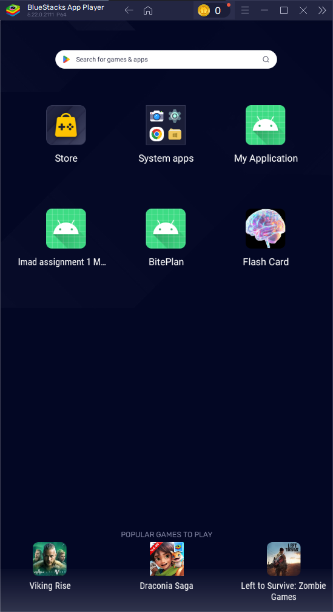
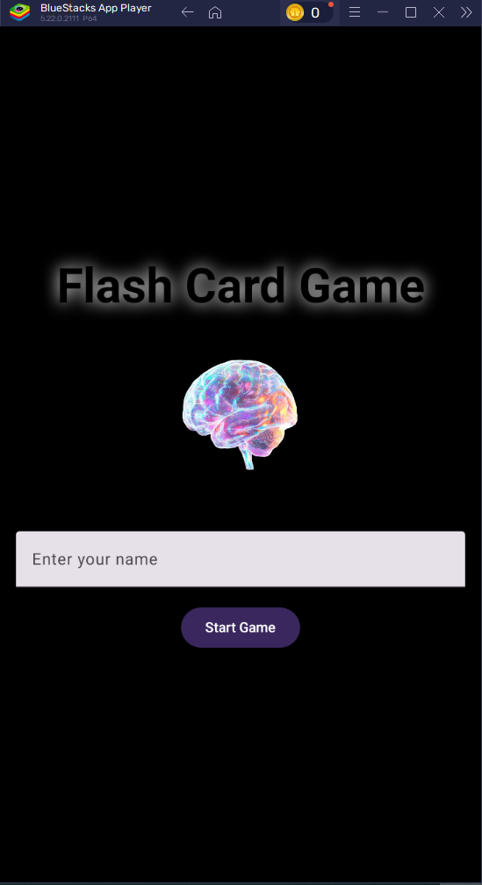
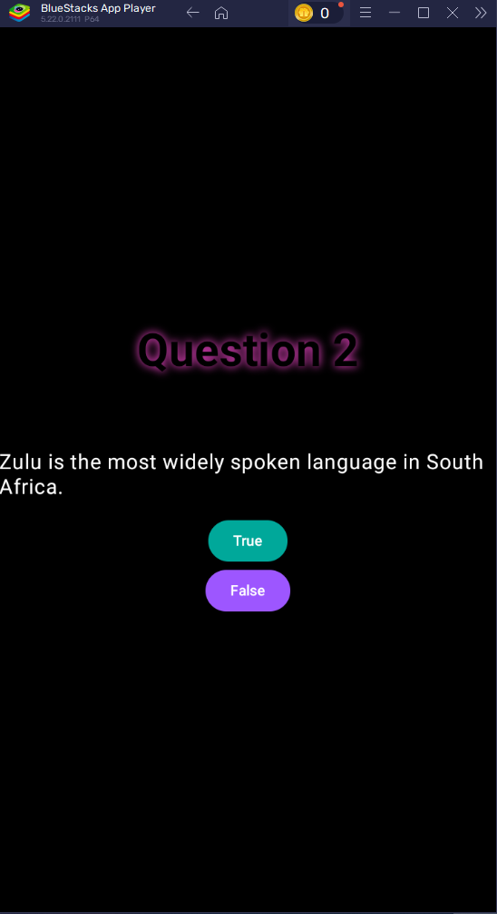
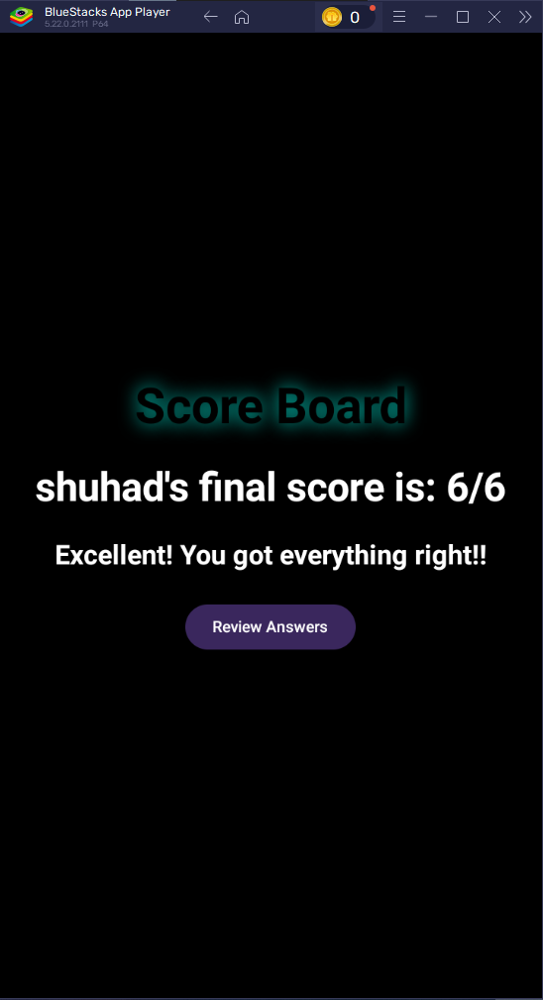
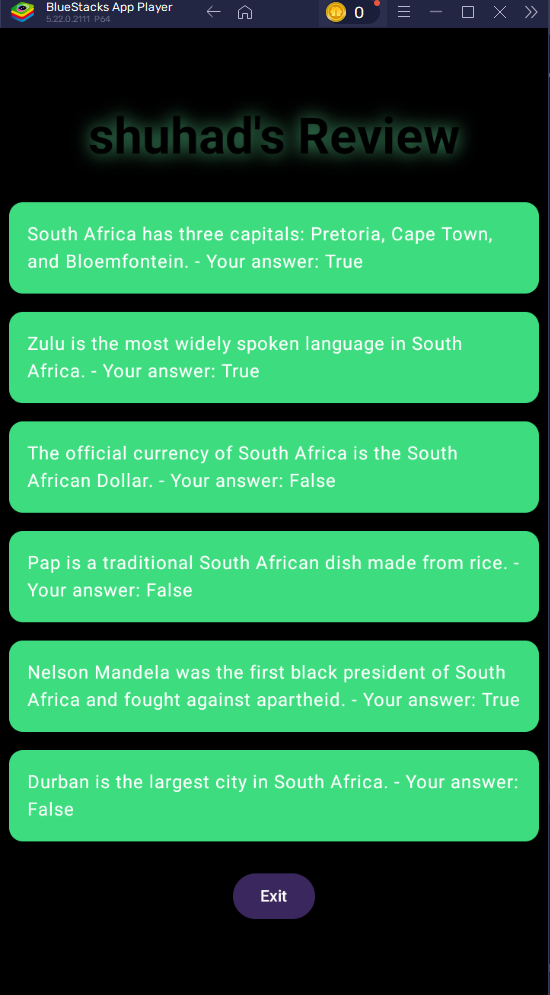

<!--
HOW TO USE:
This is an example of how you may give instructions on setting up your project locally.

Modify this file to match your project and remove sections that don't apply.

REQUIRED SECTIONS:
- Table of Contents
- About the Project
  - Built With
- Getting Started
- Author
- Future Features
- License

OPTIONAL SECTIONS:
- FAQ

After you're finished please remove all the comments and instructions!
-->

  <!-- You are encouraged to replace this logo with your own! Otherwise you can also remove it. -->
  
   

<h3><b>Flash card game</b></h3>

<!-- TABLE OF CONTENTS -->

# 📗 Table of Contents

- [📖 About the Project](#about-project)
    - [🛠 Built With](#built-with)
        - [Tech Stack](#tech-stack)
        - [Key Features](#key-features)
- [💻 Getting Started](#getting-started)
    - [Setup](#setup)
    - [Prerequisites](#prerequisites)
    - [Install](#install)
    - [Usage](#usage)
- [👥 Author](#author)
- [🔭 Future Features](#future-features)
- [📝 License](#license)

<!-- PROJECT DESCRIPTION -->

# 📖 [Flash-Card] 

**[Flash-Card]** A Kotlin based app called "Flash Card Game" to help the user when studying by asking questions "True" or "False" and the user needs to answer, then they receive a score and can review the questions they have answered both correctly and incorrectly..

**[Icon Launcher]**

 

**[Home Screen]**

 

**[Question Screen example]**

 

**[Score Screen]**

 

**[Review Screen]**

 

## 🛠 Built With <a name="built-with">Android studio and BlueStack 5</a>

### Tech Stack <a name="tech-stack">Kotlin</a>

  
Client

  <ul>
    <li><a href="https://developer.android.com/">Kotlin</a></li>
  </ul>

## Live Demo

> Live Demo [Youtube] https://youtu.be/91bOGzcmoso

<!-- GETTING STARTED -->

## 💻 Getting Started 

To get a local copy up and running, follow these steps.

### Prerequisites

In order to run this project you need:

- A Desktop or Laptop Computer running on with Windows, Mac OS or Linux operating system.
- ANDROID STUDIO
- GitHub account
- BLUESTACK 5

> Clone this repository link for the Kotlin app [KOTLIN] https://github.com/shuhad786/Flash-Card.git

### Setup

- Install Android Studio
- Create a Github account
- Install Bluestacks 5

### Usage

- Start up BlueStacks 5
- Start up Android Studio after bluestacks is fully loaded
- Copy the repository to your android studio

<!-- AUTHOR -->

## 👥 Author 

👤 **Shuhad Loofer**

- GitHub: [@Shuhad786](https://github.com/Shuhad786)

(<a href="#readme-top">back to top</a>)

<!-- FUTURE FEATURES -->

## 🔭 Future Features 

- [ ] **[Implement different categories]**
- [ ] **[Create an online Score Board]**

<!-- LICENSE -->

## 📝 License 

This project is [MIT](./LICENSE) licensed.

